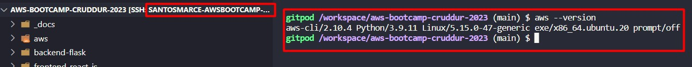
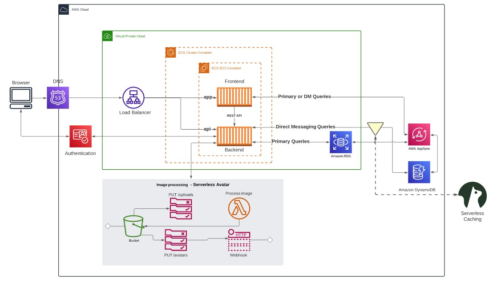
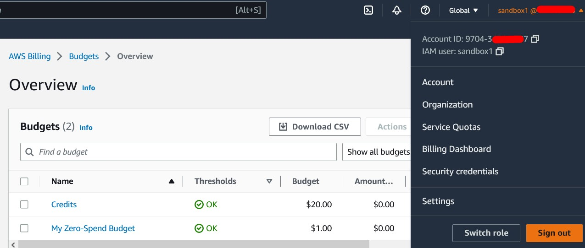

# Week 0 — Billing and Architecture
---
## Required Homework/Tasks
---
### Install and verify AWS CLI

I installed the AWS CLI as you can see on the following screenshot

### Architectural Diagram

I have re-created the architectural diagram and you can see (and comment) my version on this link (Lucidchart):

[Architectural Diagram](https://lucid.app/lucidchart/c5f755b5-6793-4c95-8414-3ff48da8631a/edit?viewport_loc=-1328%2C-898%2C4039%2C1940%2C0_0&invitationId=inv_bb45e1c7-73de-4c2a-9931-961d99376db7)

### Conceptual Diagram

I have re-created the conceptual diagram and you can see (and comment) my version on this link (Lucidchart:

[Conceptual Diagram](https://lucid.app/lucidchart/bd1479fe-be72-47bb-9116-7c09b18e81cd/edit?viewport_loc=-9%2C-2106%2C2994%2C1437%2C0_0&invitationId=inv_9d1143f7-7056-499b-86cb-ea50b194f2e5)

### Create a Budget

I have created two budgets, one for Zero Spent and one for $20, with alerts for 10%, 50%, 75% and 100%.

